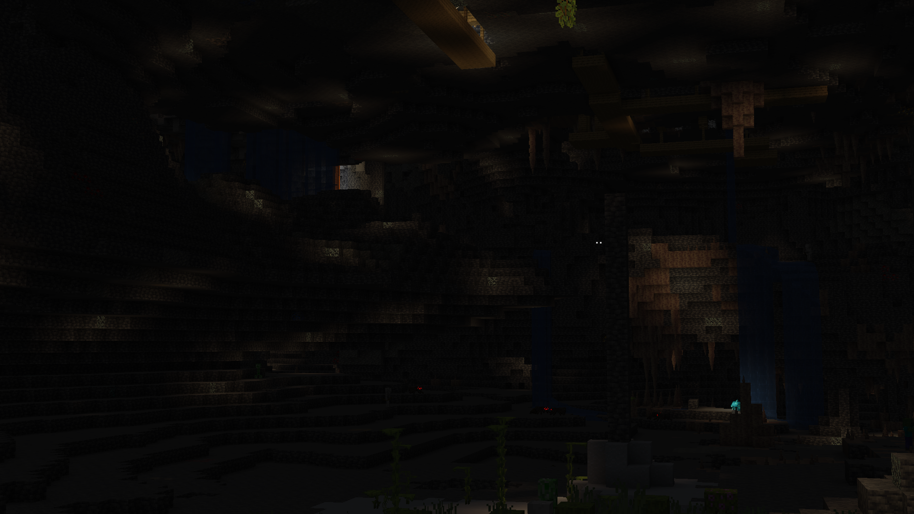

# Vanilla Plus Ultimate

This is a modpack for Minecraft 1.17.1 that despite having around 129 mods, adds very little. The goal of this modpack is to be as seamless of an addition to Minecraft as a normal game update. Added are a few biomes, like 5 mobs, and a couple blocks that exist for one type but not another (copper/gold bars, stone tiles, etc.). However I went and tweaked just about every aspect of the game.

Performance is improved, shaders are supported, crashes are fixed, some of your favorite Minecraft mod mainstays like inventory sorting and right click harvesting are here, and so much more. This is the result of about 6 years of tinkering with Vanilla Plus style packs and mods and figuring out what really fits with the game and what is cool, but not quite what I want.

There will likely be very few additions from now on, I will just continue to update mods as they come out. If there are mods added it will be v1.x, updates and minor tweaks will not be issued as a release.

## Screenshots (More Coming Soon)

### Installation

I use linux, so I don't have access to the curseforge launcher to upload this or test. As such this is made in and packaged for the open source [MultiMC](https://multimc.org/) launcher. If you want to work with me to upload this to curseforge, let me know and we can hop in a discord call. I'm @protodrew@merveilles.town on the fediverse or @prototyped_drew:matrix.org on matrix

#### Option 1, using a release

1. Download the Zip
2. In [MultiMC](https://multimc.org/), click the 'Add Instance' button on the top left
3. select the 'Import from zip' option
4. click browse and select the downloaded zip
5. Enjoy :)

#### Option 2, using the repo

1. clone the git repo directly into the instances folder. (keep in mind this will add a bunch of extra garbage like the README and screenshots, but it wont effect the back running)

### Mods (Links will be added over time)

- 'Slight GUI Modifications' 
- 3D Skin Layers 
- Additional Bars 
- Animal Feeding Trough 
- AntiGhost 
- Antique Atlas 
- Architectury 
- Atmosfera 
- Auth Me 
- Axes Are Weapons 
- Axolotl Item Fix
- Better Beds 
- Better Biome Blend 
- Better Dropped Items 
- Better Nether Map 
- Better Recipe Book 
- Better Sleeping 
- BetterF3 
- BetterThanMending 
- Blame 
- Blur (Fabric) 
- Boat Item View 
- Borderless Mining Reworked 
- Capes 
- Caracal mob 
- Cauldron Fix 
- Caves and Cliffs add-on for William Wythers Overhauled Overworld 
- Charmonium 
  Cloth API 
- Cloth Config v5 
- Clumps 
- Colytra 
- Concurrent Chunk Management Engine 
- Connectible Chains 
- Consistency Plus 
- Couplings 
- Crafting Pad 
- Cull Leaves 
- Custom Fog
- Custom Splash Screen
- Debrand
- Deepslate Cutting
- Diggus Maximus 
- Disable Custom Worlds Advice 
- Drip Sounds 
- Dynamic FPS 
- Dynamic Music 
- EasyAutoCrafting 
- Eating Animation 
- Enhanced Block Entities 
- EntityCulling 
- Extended bookshelves 
- Extra Sounds 
- Fabric API 
- Fabric Language Kotlin 
- FabrilousUpdater 
- Fabrishot 
- Fabulous Clouds 
- Falling Leaves 
- Falling-Tree 
- FastChest 
- FerriteCore 
- Flesh2Leather 
- Glassential 
- Goblin Traders 
- Grind Enchantments 
- Grizzly Bear mob 
- Horse Stonks 
- Hydrogen
- Illuminations 
- Independent Pets 
- Indium 
- Infinity Fix 
- Item Model Fix 
- Krypton
- LambdaBetterGrass 
- LambDynamicLights 
- Lapis Reserve 
- LazyDFU 
- Let Sleeping Dogs Lie 
- Light Overlay 
- Litematica 
- Lithium
- Lovely Snails
- MaLiLib
- Mod Menu 
- More Structures add-on for William Wythers Overhauled Overworld 
- MoreVillagersFabric 
- Mouse Wheelie 
- No Fade 
- No More Score 
- Not Enough Crashes 
- Not Forgotten 
- ParadoxSlabs 
- Passable Leaves 
- Presence Footsteps 
- Primordial Shores add-on for William Wythers Overhauled Overworld 
- Quick Spyglasser 
- Raw Ores To Blocks 
- Right-Click-Harvest 
- Roundaround's Villager Converting 
- Seamless Loading Screen
- Semi Translucency
- Shield Disruptor
- Silk That Amethyst
- SimpleBackpack
- Slabs From Wood
- SlotLock
- Smooth Boot
- Smoother Bedrock
- Snow Under trees
- Soul Lights
- Tax Free Levels
- Traverse
- Villagers Follow Emeralds
- Visuality
- Wandering Collector
- Waystones
- William Wythers Overhauled Overworld
- YOSBR (Your options shall be respected)

#### Texture Pack Credits

Credits:
Vanilla Tweaks: https://vanillatweaks.net/

Very cool site with datapacks, resource packs, and more.

Shader: 

Sildur's Enchanced Default: https://sildurs-shaders.github.io/